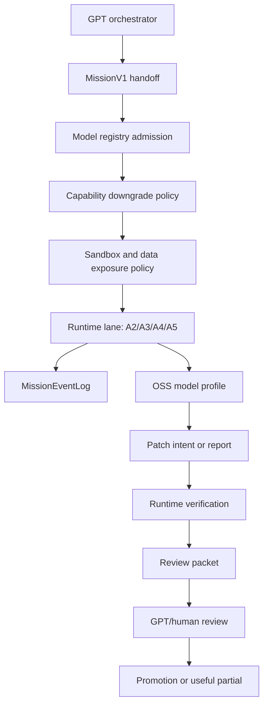
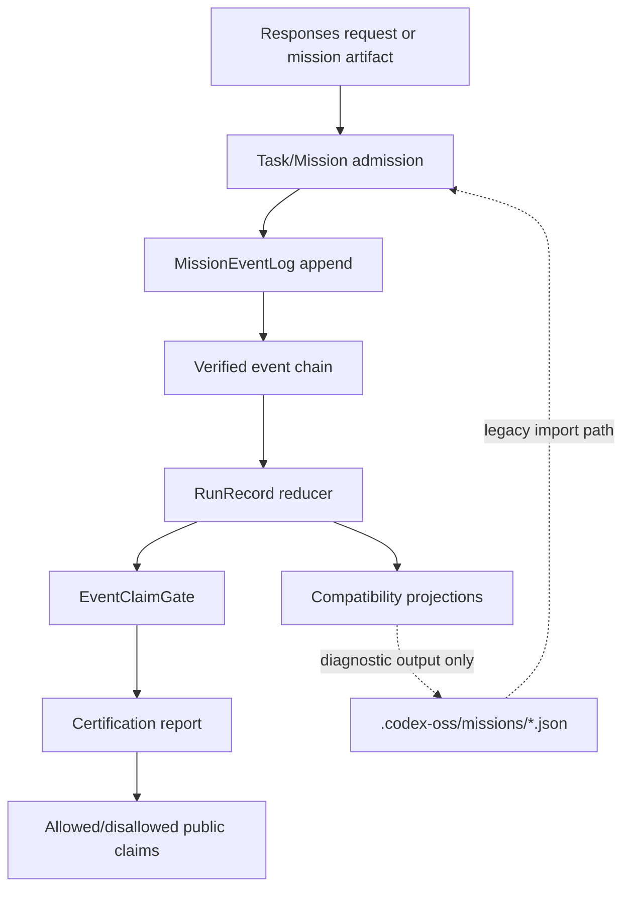
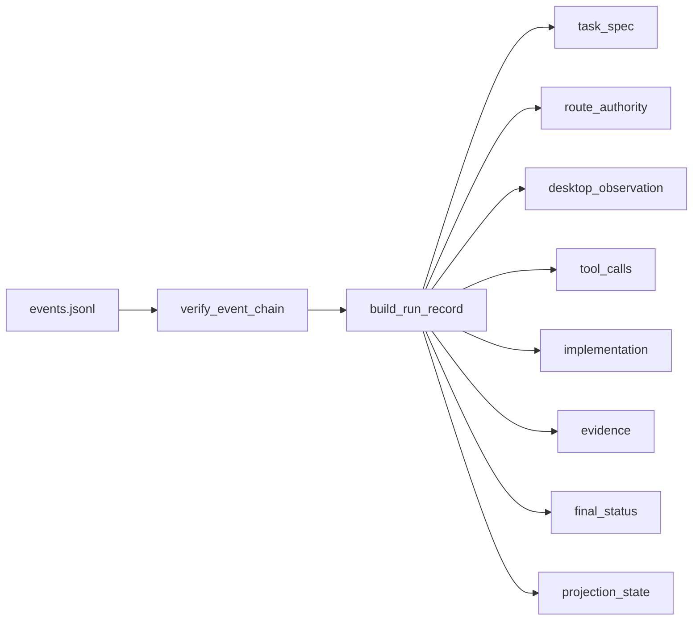
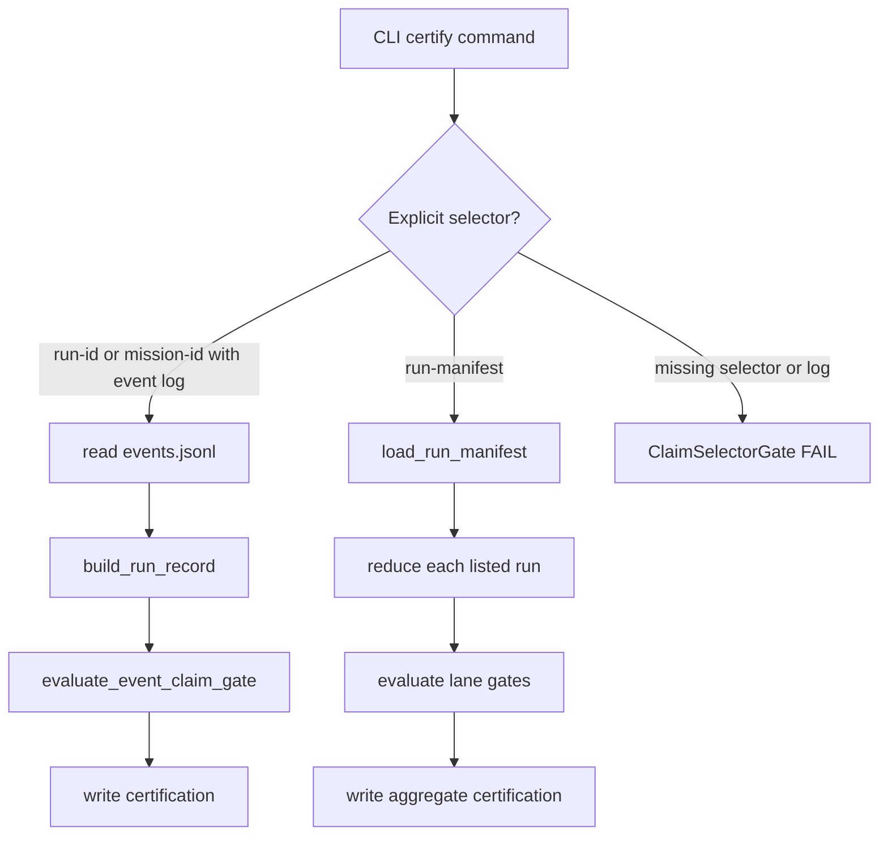
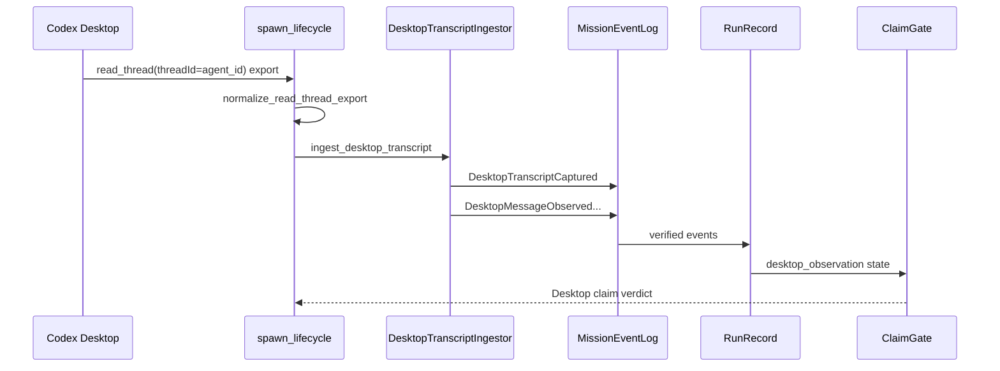
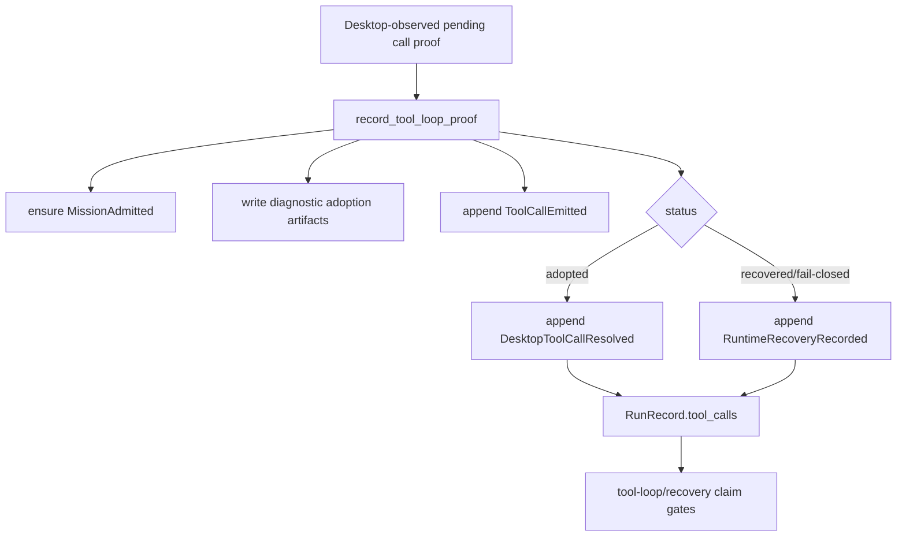
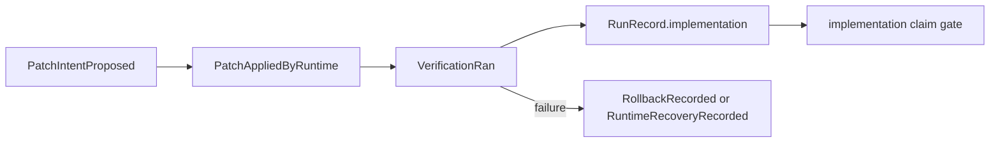

# opencode-bridge Architecture

**Last verified**: 2026-06-06

This document describes the current architecture of `opencode-bridge` after the Mission Event Log / RunRecord implementation, the model-agnostic native OSS runtime work, and the follow-up zero-tech-debt deletion pass.

## Executive Summary

`opencode-bridge` is now event-log-first for claim-bearing OSS native behavior and model-agnostic for runtime-controlled OSS delegation.

The bridge still exposes an OpenAI Responses-compatible surface, but native certification no longer treats scattered mission artifacts as authority. A managed mission is represented by an append-only, hash-chained `MissionEventLog`; reducers build a `RunRecord`; pure claim predicates evaluate that record; compatibility JSON files are projections or diagnostics.

Runtime-controlled OSS agents use MissionV1 contracts across read-only, review, docs, patch proposal, and isolated implementation lanes. DeepSeek is the default high-reasoning implementation profile today, but the interface is not DeepSeek-specific: Kimi, Flash, Qwen, and other configured OpenCode-backed profiles enter through the same admission, downgrade, sandbox, scorecard, review, and promotion gates.

The old bespoke Desktop tool-loop probe architecture has been deleted. There is no `desktop_tool_loop_probe` MissionV1 field, schema validator, module, protocol test suite, production route, or adoption handler. Tool-loop and recovery proof now use ordinary lifecycle events.

## Zero-Tech-Debt Verdict

The intended architecture is present and the known old architecture surfaces have been removed.

| Planned End State | Current Status |
|---|---|
| `MissionEventLog` is runtime authority | Implemented in `codex_oss/mission_event_log.py`. |
| Event vocabulary and redaction are centralized | Implemented in `codex_oss/mission_events.py`. |
| `RunRecord` is reduced from events | Implemented in `codex_oss/run_record.py`. |
| Claim gates evaluate reducer state | Implemented in `codex_oss/event_claim_gate.py` and used by `codex_oss/native_certification.py`. |
| Desktop transcript import is an event source | Implemented in `codex_oss/desktop_transcript_ingestor.py` and integrated in `codex_oss/spawn_lifecycle.py`. |
| Tool-loop/recovery proof is ordinary event lifecycle | Implemented in `codex_oss/tool_loop_proof.py`. |
| Aggregates use explicit run manifests | Implemented in `codex_oss/run_manifest.py` and event-backed aggregate certification. |
| Projections are compatibility output, not authority | Implemented in `codex_oss/projections.py`. |
| Old probe route/schema/module removed | Confirmed: no `desktop_tool_loop_probe` references remain. |
| Claim-bearing certification requires explicit selector | Implemented: no `_latest_mission_id` selector remains. |
| Certification-time backfill removed | Confirmed: no `ensure_derived_desktop_gold_artifacts` path remains. |
| Artifact fallback certification removed | Implemented: `native-like` and `desktop-gold` return selector failure unless the selector resolves to an event log. |
| Model-agnostic runtime admission exists | Implemented in `codex_oss/model_registry.py`, `codex_oss/capability_downgrade.py`, and routing thresholds. |
| Implementation escrow is runtime-owned | Implemented in `codex_oss/native_runtime_contracts.py`, `codex_oss/native_subagent.py`, and promotion/review gates. |
| GPT usage preservation is measured | Implemented in `codex_oss/native_runtime_contracts.py` and capability scorecards. |

The remaining `.codex-oss/missions/<mission_id>/` files are not claim authority. They exist for diagnostics, compatibility output, and artifact-to-event import during migration from older mission directories.

## Architectural Principles

1. **One authority source per run**: the append-only event log.
2. **Reducers, not side effects**: current mission state is derived by reducing events.
3. **Claims require causes**: Desktop, tool-loop, recovery, and implementation claims pass only when their causal events exist.
4. **Desktop observation is separate from runtime emission**: runtime progress does not prove Desktop UX until raw Desktop transcript events are ingested.
5. **Compatibility files are outputs or import inputs**: they are not certification authority.
6. **Raw direct lanes remain research-only**: raw OSS evidence can diagnose behavior but cannot certify Desktop-native claims.
7. **Implementation is escrowed**: OSS models propose and execute bounded work through runtime-owned scope, isolated apply, verification, review, and promotion gates.
8. **GPT usage is preserved by design**: GPT-5.5 should spend quota on planning, review, and judgment, not first-pass implementation tool loops.

## Top-Level Module Map

| Module | Interface | Responsibility |
|---|---|---|
| `bridge.py` | Responses-compatible HTTP adapter | Accepts `/v1/responses` traffic, routes managed missions, handles continuations, and emits Responses-compatible output. |
| `codex_oss/managed_bridge.py` | Managed MissionV1 runtime entry | Runs managed read/review/context missions and writes mission artifacts plus event admission/finalization through shared helpers. |
| `codex_oss/mission_event_log.py` | `MissionEventLog` | Appends, reads, and verifies hash-chained event streams under `.codex-oss/runs/<run_id>/events.jsonl`. |
| `codex_oss/mission_events.py` | Event vocabulary and payload validation | Defines valid event types, source kinds, authorities, required payload fields, timestamp checks, and secret redaction. |
| `codex_oss/run_record.py` | `build_run_record(events)` | Reduces verified event history into current mission state. |
| `codex_oss/event_claim_gate.py` | `evaluate_event_claim_gate(record, target=...)` | Evaluates event-backed native, Desktop Gold, tool-loop, and implementation claims. |
| `codex_oss/native_certification.py` | `certify_*_project(...)` | Writes certification reports from event-backed `RunRecord` state and explicit run manifests. |
| `codex_oss/desktop_transcript_ingestor.py` | `ingest_desktop_transcript(...)` | Converts raw Codex Desktop spawned-agent transcripts into Desktop observation events. |
| `codex_oss/spawn_lifecycle.py` | `finalize_spawn_lifecycle(...)` | Persists spawn receipt, normalizes `read_thread` exports, ingests Desktop events, and runs targeted certification. |
| `codex_oss/tool_loop_proof.py` | `record_tool_loop_proof(...)` | Records Desktop-observed pending-call adoption, recovery, or fail-closed evidence as events. |
| `codex_oss/mission_event_bridge.py` | Artifact-to-event bridge | Imports existing mission artifacts into event logs for runtime transition support. |
| `codex_oss/projections.py` | Projection writer and drift checker | Generates compatibility mission files from `RunRecord` and detects projection drift. |
| `codex_oss/run_manifest.py` | Run manifest validator | Validates explicit aggregate coverage manifests for broad parity claims. |
| `codex_oss/model_registry.py` | Model/profile registry | Admits configured models into lanes and records resolved model identity. |
| `codex_oss/capability_downgrade.py` | Downgrade policy | Prevents silent weaker fallback across capability tiers. |
| `codex_oss/native_runtime_contracts.py` | Native runtime contracts | Coordinates phase receipts, implementation escrow, review packets, data exposure, sandbox checks, usage displacement, and scorecards. |
| `codex_oss/tool_turn_transaction.py` | Tool turn transaction contract | Bounds tool call, continuation, recovery, and fail-closed lifecycle. |

## Model-Agnostic Native Runtime

MissionV1 is the public contract. Model-specific names such as `mission-a5-deepseek` are profile aliases, not special-case code paths.



The native contract is the same for DeepSeek, Kimi, Flash, Qwen, and future OpenCode-backed models:

- the runtime admits or refuses the profile for the lane;
- weaker fallback cannot silently replace an explicit user choice;
- read-only lanes may run concurrently under scheduler policy;
- write lanes require owned paths and locks;
- A5 implementation applies in an isolated worktree;
- final output uses a canonical result schema plus a human-readable projection;
- accepted, rejected, and useful-partial outcomes update scorecards.

## Implementation Escrow

Implementation work is valuable because it displaces GPT-5.5 tool-turn usage. The goal is not to prove OSS models always outperform GPT. The goal is to let OSS models do bounded first-pass labor while GPT keeps the scarce planning/review/judgment role.

For A4/A5:

1. GPT or the user defines scope, risk, owned paths, forbidden paths, and verification.
2. The runtime validates MissionV1, model capability, sandbox policy, and data exposure policy.
3. The model proposes patch intent, rationale, and next actions.
4. The runtime builds/checks/apply-tests the patch, with A5 isolated from the main workspace.
5. Verification adequacy, semantic review, repair convergence, and review packet adequacy are evaluated.
6. GPT/human review accepts, rejects, requests repair, or marks the result useful-partial.
7. Promotion is an explicit transaction; the main workspace does not change during the runtime attempt.

The committed real-code canary under `canaries/oss_real_code_canary_005/` proves this flow on a small promoted patch.

## Authority Model



The solid path is current authority. The dotted path is compatibility and diagnostics.

## Event Log

`MissionEventLog` stores one event stream per run:

```text
.codex-oss/runs/<run_id>/events.jsonl
```

Each event has:

| Field | Purpose |
|---|---|
| `schema_version` | Must be `mission_event.v1`. |
| `run_id` | Stable execution identity. |
| `mission_id` | Compatibility identity, usually equal to `run_id`. |
| `event_id` | Unique event identity within the run. |
| `seq` | 1-based monotonic sequence number. |
| `prev_hash` | Hash of the previous event, empty for seq 1. |
| `event_hash` | Hash of the canonical event body excluding `event_hash`. |
| `event_type` | One of the supported mission lifecycle events. |
| `source_kind` | Producer class: `runtime`, `desktop_app`, `adapter`, `model`, `projection`, `cli_import`, or `test_fixture`. |
| `authority` | Evidence authority: `runtime_authoritative`, `desktop_observed`, `model_narrative`, `compatibility_projection`, or `diagnostic_only`. |
| `created_at` | Timezone-aware ISO timestamp. |
| `payload` | Event-specific JSON after secret redaction. |

The log rejects unsupported event types, unsupported source kinds, unsupported authorities, missing required payload fields, duplicate event IDs, sequence mismatches, previous-hash mismatches, tampered payload hashes, and timestamps without timezones.

## Event Vocabulary

The supported event vocabulary is centralized in `codex_oss/mission_events.py`.

| Event Type | Authority Role |
|---|---|
| `MissionAdmitted` | Establishes `run_id`, task policy, route class, risk, tools, model, and write policy. |
| `ModelNarrationEmitted` | Captures model-authored narrative. |
| `RuntimeProgressEmitted` | Captures runtime progress diagnostics. |
| `DesktopTranscriptCaptured` | Captures transcript import and provenance. |
| `DesktopMessageObserved` | Captures user-observed Desktop child messages. |
| `ToolCallEmitted` | Records a Responses-compatible tool call emitted by runtime. |
| `DesktopToolCallResolved` | Records Desktop adoption of a pending tool call. |
| `RuntimeRecoveryRecorded` | Records recovery or fail-closed behavior. |
| `PatchIntentProposed` | Records model-owned patch intent. |
| `PatchAppliedByRuntime` | Records runtime-owned patch application. |
| `VerificationRan` | Records verification command outcome. |
| `RollbackRecorded` | Records rollback or fail-closed patch recovery. |
| `MissionFinalized` | Records terminal mission status and final text hash. |
| `ProjectionWritten` | Records compatibility projection writes. |
| `ClaimGateEvaluated` | Records claim-gate evaluation metadata. |

## RunRecord Reducer

`RunRecord` is the current-state representation of a run. It is not authored directly; it is reduced from verified events.



| RunRecord Field | Derived From |
|---|---|
| `task_spec` | `MissionAdmitted.payload.task_spec` |
| `route_authority` | `MissionAdmitted.payload.route_class`, model, write policy |
| `desktop_observation` | `DesktopTranscriptCaptured`, `DesktopMessageObserved` |
| `tool_calls` | `ToolCallEmitted`, `DesktopToolCallResolved`, `RuntimeRecoveryRecorded` |
| `implementation` | `PatchIntentProposed`, `PatchAppliedByRuntime`, `VerificationRan`, `RollbackRecorded` |
| `final_status` | `MissionFinalized` |
| `projection_state` | `ProjectionWritten` |
| `source_event_hash` | last verified event hash |

## Claim Gates

`event_claim_gate.evaluate_event_claim_gate()` is the main claim predicate surface.

| Target | Required Event-Backed State |
|---|---|
| `native-like` / `desktop-gold` | Managed route authority plus trusted Desktop observation with at least three pre-final messages and a final message. |
| `tool-loop` | Trusted Desktop observation plus all emitted tool calls resolved or recovered, and no raw-direct route. |
| `implementation` | Trusted Desktop observation plus model patch intent, runtime apply success, passing verification, and no raw-direct route. |

Claim-gate output contains `ok`, `status`, `allowed_claims`, `disallowed_claims`, `basis_event_ids`, and `missing_evidence`.

## Certification

Claim-bearing certification in `codex_oss/native_certification.py` is event-backed.



There is no implicit latest-mission selector. Claim-bearing commands require an explicit `--run-id`, `--mission-id` backed by an event log, or `--run-manifest`.

| Target | Current Authority |
|---|---|
| `native-like` | Single event-backed `RunRecord`. |
| `desktop-gold` | Single event-backed `RunRecord`. |
| `oss-native-parity` with `--mission-id` | Single run evaluated as an aggregate manifest of one. |
| `oss-native-parity` with `--run-manifest` | Explicit multi-run manifest. |

If a selector does not point to an event log, certification returns a claim-selector failure instead of falling back to mission artifacts.

## Desktop Transcript Ingestion

Desktop observation enters the event architecture through `desktop_transcript_ingestor.ingest_desktop_transcript()`.



A transcript is trusted only when:

- `consumer_kind == "codex_desktop_spawned"`
- `transcript_kind == "codex_desktop_raw_export"`
- `agent_id` or `thread_id` matches the expected spawned child identity

Otherwise, transcript events may be written as `diagnostic_only`, but they cannot satisfy Desktop-native claims.

## Spawn Lifecycle

`spawn_lifecycle.finalize_spawn_lifecycle()` owns repo-side finalization after Desktop spawning.

It:

1. Ensures the mission has an admission event.
2. Writes or merges `spawn_receipt.json`.
3. Ensures `route_authority.json` diagnostic/projection output exists.
4. Normalizes a `codex_app.read_thread` export into `desktop_thread_transcript.json`.
5. Runs Desktop observation capture for diagnostic artifacts.
6. Ingests the raw transcript into the event log.
7. Runs event-backed targeted certification.
8. Writes `spawn_lifecycle_proof.json`.

The spawn receipt records that `agent_id` is the canonical transcript identity.

## Tool Loop And Recovery

The current architecture does not use a bespoke probe route.

Tool-loop and recovery proof enters through `tool_loop_proof.record_tool_loop_proof()`:



The diagnostic files `adoption_or_recovery.json`, `tool_call_adoption_probes.json`, and `recovery_proof.json` can still be written for operator visibility and older reports. They are not claim authority.

## Implementation Lane

Implementation parity requires event evidence for both model intent and runtime authority:



The reducer marks implementation `ok` only when:

- patch intent exists
- runtime apply has `apply_status=success`
- at least one verification ran
- all verification exit codes are zero

The old model-as-authority interpretation is not accepted.

## Aggregate Parity

Broad parity claims require an explicit `run_manifest.v1`.

```json
{
  "schema_version": "run_manifest.v1",
  "runs": [
    {
      "run_id": "desktop_progress_run",
      "lanes": ["desktop_progress"]
    },
    {
      "run_id": "tool_loop_run",
      "lanes": ["tool_loop", "recovery"]
    },
    {
      "run_id": "implementation_run",
      "lanes": ["implementation"]
    }
  ]
}
```

Aggregate certification reduces only the listed runs. It does not glob mission directories and does not select the newest run.

## Projections And Diagnostics

Compatibility projections are still part of the system, but they are not authority for current claim gates.

| File/Artifact | Current Role |
|---|---|
| `.codex-oss/runs/<run_id>/events.jsonl` | Current authority. |
| `.codex-oss/missions/<mission_id>/run_record.json` | Projection/debug output. |
| `.codex-oss/missions/<mission_id>/mission_summary.json` | Projection/debug output. |
| `.codex-oss/missions/<mission_id>/desktop_thread_transcript.json` | Raw transcript material used by ingestor, also diagnostic. |
| `.codex-oss/missions/<mission_id>/spawn_receipt.json` | Spawn identity diagnostic and lifecycle input. |
| `.codex-oss/missions/<mission_id>/route_authority.json` | Diagnostic/projection output for Desktop route context. |
| `.codex-oss/missions/<mission_id>/adoption_or_recovery.json` | Diagnostic output for tool-loop/recovery. |
| `.codex-oss/missions/<mission_id>/tool_call_adoption_probes.json` | Diagnostic output for adoption/recovery. |
| `.codex-oss/certifications/*.json` | Certification output. |

`projections.check_projection_drift()` compares projection source hashes against current `RunRecord` hashes.

## Legacy Architecture Removed

The following old architecture surfaces are absent from the current code:

| Old Surface | Status |
|---|---|
| `codex_oss/desktop_tool_loop_probe.py` | Deleted. |
| MissionV1 `desktop_tool_loop_probe` field | Deleted. |
| Probe schema validator | Deleted. |
| Probe-specific protocol tests | Deleted. |
| Production route for bespoke Desktop pending-call probes | Deleted and verified absent. |
| `_latest_mission_id` certification fallback | Deleted. |
| `ensure_derived_desktop_gold_artifacts` certification backfill | Deleted. |
| `native-like` / `desktop-gold` artifact fallback certification | Deleted. |
| Claim-bearing CLI flags `--handoff`, `--transcript`, `--route-authority` | Deleted from `certify`. |

## What Still Exists By Design

Some modules still read or write legacy-named files. That is not the old authority architecture by itself.

| Surface | Why It Remains |
|---|---|
| `desktop_native_verifier.py` | Standalone diagnostic verifier and Desktop observation tooling. |
| `desktop_observation.py` | Builds witness/projection artifacts and supports diagnostic CLI flows. |
| `mission_event_bridge.py` | Converts existing mission artifacts into event logs at runtime and during migration. |
| `mission_authority_artifacts.py` | Writes compatibility mission artifacts and ensures mission admission/finalization events. |
| `tool_loop_proof.py` diagnostic JSON writes | Preserves operator-visible proof files while appending authoritative events. |
| `route_authority.json` | Diagnostic/projection output used by lifecycle tooling and older reports. |

These surfaces are allowed only as diagnostics, projections, or event-import inputs. Claim-bearing certification does not use them as final authority.

## Validation

The current architecture was verified with:

```bash
PYTHONPATH=. rtk python3 tests/test_mission_event_log.py
PYTHONPATH=. rtk python3 tests/test_run_record_reducer.py
PYTHONPATH=. rtk python3 tests/test_event_based_certification.py
PYTHONPATH=. rtk python3 tests/test_native_certification.py
PYTHONPATH=. rtk python3 tests/test_protocol_conformance.py
PYTHONPATH=. rtk python3 tests/test_runtime_contracts.py
```

Results:

| Suite | Result |
|---|---|
| `tests/test_mission_event_log.py` | 3 passed |
| `tests/test_run_record_reducer.py` | 2 passed |
| `tests/test_event_based_certification.py` | 4 passed |
| `tests/test_native_certification.py` | 18 passed |
| `tests/test_protocol_conformance.py` | PASS |
| `tests/test_runtime_contracts.py` | PASS |

## Reading Guide

Start here:

1. `codex_oss/mission_event_log.py`
2. `codex_oss/mission_events.py`
3. `codex_oss/run_record.py`
4. `codex_oss/event_claim_gate.py`
5. `codex_oss/native_certification.py`

Then inspect integration paths:

1. `codex_oss/desktop_transcript_ingestor.py`
2. `codex_oss/spawn_lifecycle.py`
3. `codex_oss/tool_loop_proof.py`
4. `codex_oss/mission_event_bridge.py`
5. `codex_oss/projections.py`

The important interface is now small: event log in, run record out, claim gate evaluated from the record.
